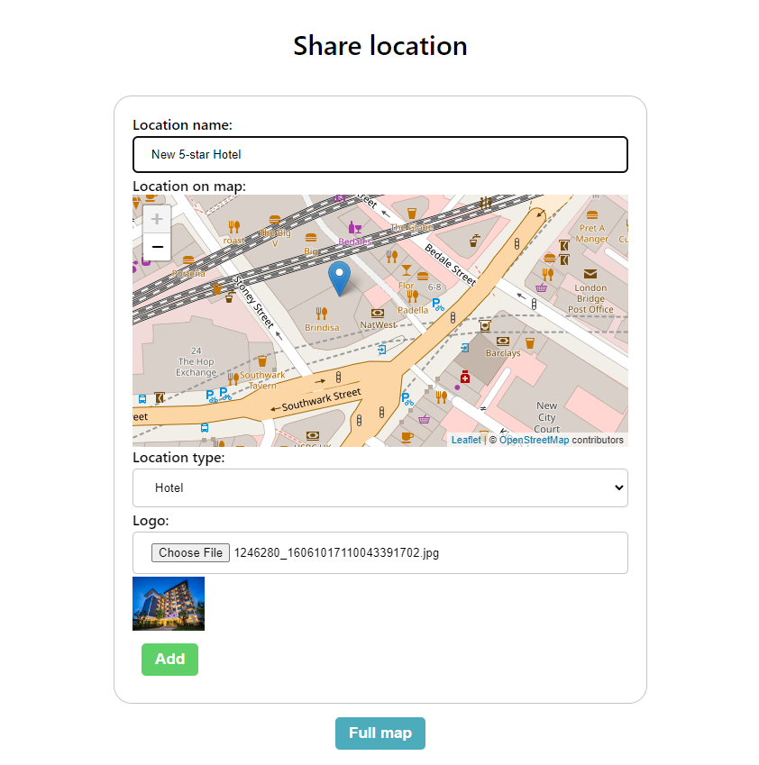

# Share Location
A Web app which users can add new places to the universal map

## Demo
Demo is available [here](https://share-location.vercel.app/).

## Screenshots




## Run Locally

Clone the project

```bash
  git clone https://github.com/yasinbordbar/share-location.git
```

Go to the project directory

```bash
  cd share-location
```

Install dependencies

```bash
  npm install
```

Start the server

```bash
  npm start
```


## Tech Stack


